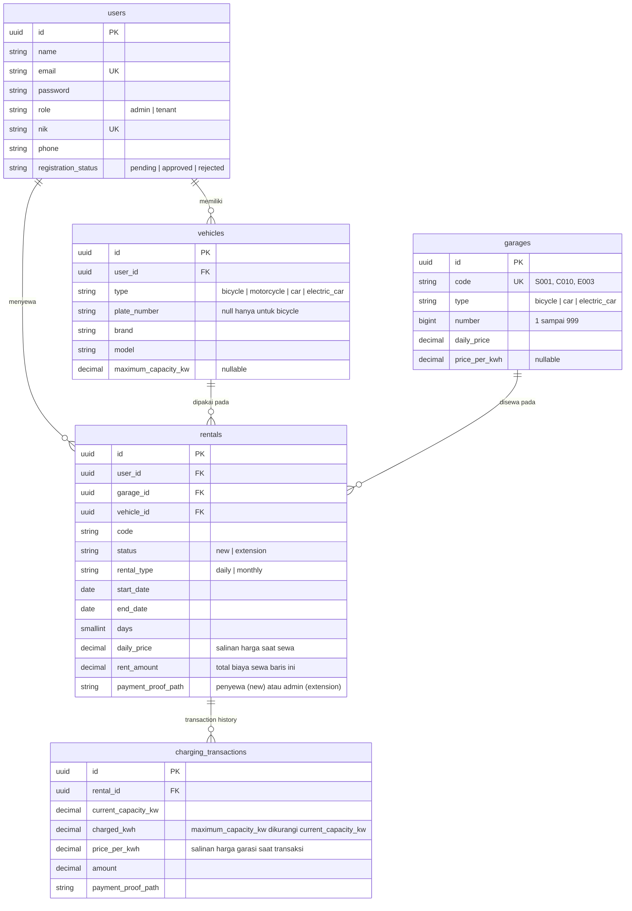

# ERD - Penyewaan Garasi

```mermaid
erDiagram
    users ||--o{ vehicles : "memiliki"
    users ||--o{ rentals : "menyewa"
    vehicles ||--o{ rentals : "dipakai pada"
    garages ||--o{ rentals : "disewa pada"
    rentals ||--o{ charging_transactions : "transaction history"

    users {
        uuid id PK
        string name
        string email UK
        string password
        string role "admin | tenant"
        string nik UK
        string phone
        string registration_status "pending | approved | rejected"
    }

    vehicles {
        uuid id PK
        uuid user_id FK
        string type "bicycle | motorcycle | car | electric_car"
        string plate_number "null hanya untuk bicycle"
        string brand
        string model
        decimal maximum_capacity_kw "nullable"
    }

    garages {
        uuid id PK
        string code UK "S001, C010, E003"
        string type "bicycle | car | electric_car"
        bigint number "1 sampai 999"
        decimal daily_price
        decimal price_per_kwh "nullable"
    }

    rentals {
        uuid id PK
        uuid user_id FK
        uuid garage_id FK
        uuid vehicle_id FK
        string code 
        string status "new | extension"
        string rental_type "daily | monthly"
        date start_date
        date end_date
        smallint days
        decimal daily_price "salinan harga saat sewa"
        decimal rent_amount "total biaya sewa baris ini"
        string payment_proof_path "penyewa (new) atau admin (extension)"
    }

    charging_transactions {
        uuid id PK
        uuid rental_id FK
        decimal current_capacity_kw
        decimal charged_kwh "maximum_capacity_kw dikurangi current_capacity_kw"
        decimal price_per_kwh "salinan harga garasi saat transaksi"
        decimal amount
        string payment_proof_path 
    }
```
